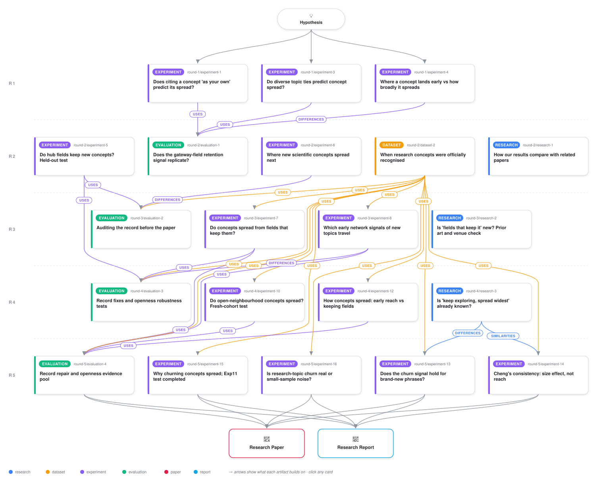

# Concepts spread where they stick: network signals of interdisciplinary diffusion in science

<div align="center">

<a href="https://cdn.jsdelivr.net/gh/ai-inventor-papers/ai-invention-8795ea-concepts-spread-once-adopters-make-them@fork/run_AawnV1HvzpNx/workflow.svg">
<picture>
  <source media="(prefers-color-scheme: dark)" srcset="workflow-dark.svg">
  
</picture>
</a>

<sub>🖱️ <b><a href="https://cdn.jsdelivr.net/gh/ai-inventor-papers/ai-invention-8795ea-concepts-spread-once-adopters-make-them@fork/run_AawnV1HvzpNx/workflow.svg">Open the interactive diagram</a></b> — every card links to its artifact folder.</sub>

</div>

> **TL;DR** — Concepts spread next to fields related to the ones currently retaining them, confirmed in a pre-registered held-out test on 3,162 concepts (conditional-logit coefficient d_0 = 0.322 [0.291, 0.355], positive in all four domain groups). Seven early co-occurrence network indicators predict rarefied cross-field breadth beyond a strong popularity baseline, with a pooled openness-breadth association of +0.069 [+0.038, +0.100] across six independent evaluation bodies. A decomposition shows that 73% of the breadth gap between integrating and localised concepts is early contact diversity, while continued frontier advance contributes near zero.

<details>
<summary>Full hypothesis</summary>

MAIN CLAIM (a LEAD, deepened once; this is the run's final test). New concepts whose HOME-field co-occurrence neighbourhood keeps taking in novel, unexpected partners and keeps churning in t0..t0+2 become more broadly integrated across disciplines than equally sized, equally reached concepts whose home neighbourhood is stable. 'Novel' means high NOV_res: new neighbours outside the community a degree-matched null expects. 'Churning' means low edge_persistence. Integration is size-adjusted breadth: O2r_m50 and O2r_resid at t0+6..t0+8. The claim has two halves, and both answer RQ1's 'which signals are robust vs artefacts / domain-specific' directly.
(i) REACH-VS-DEPTH REVERSAL. Neighbourhood consistency is what Cheng et al. 2023 (ASR) call 'ideational consistency': the cosine of neighbour co-usage from t-1 to t, i.e. weighted edge persistence. It predicts next-year VOLUME without a size control. Net of size, the same property predicts that a concept stays LOCAL. This separates the request's two cases: 'frequent within one narrow subfield' and 'diffuses broadly'.
(ii) MEASUREMENT WARNING. The community-diversity indicators that look strongest in the literature's all-papers builds (n_comm_W3, participation; Weng-style structural diversity) are largely the outcome measured early. Off-home papers inside the ego network carry them. They vanish in a home-only build.
The one-sentence finding we expect to state: 'Early churn inside a concept's home neighbourhood anticipates its cross-field breadth across domains, while the number of communities it touches is mostly its spread measured early, and the neighbourhood consistency that predicts a concept's growth predicts, net of size, that it stays local.'
MECHANISM. Interpretive flexibility and exploration (March 1991; Star & Griesemer 1989). While a concept's home partner set is still being recombined, its meaning is not yet bound to one problem set, so distant fields can adopt it at low adaptation cost. Consolidation (Burt closure; Cheng's consistency) deepens local use and raises the translation cost for other fields. Openness is a BETWEEN-concept trait fixed early, NOT a within-concept dynamic: the run's own within-concept closure test is null (see below). The paper must say this.

EVIDENCE BEHIND IT (executed numbers only; partial Spearman given B5 unless stated).
- Fresh 2015-2017 cohort (art_NMe386dX9GLF; hash-sealed, single unseal; n = 573 with OPEN_home, 634 with O2r_m50; the declared 2017 extension was applied because pre-seal power was 0.16, MDE 0.105).
  - OPEN_home: R0 +0.123, R2 +0.091 [0.013, 0.171], R3 +0.080 [0.001, 0.162], R4 +0.069 [-0.012, 0.150], R5 +0.056 [-0.022, 0.135].
  - DL over groups +0.083 [-0.007, 0.173]; 4/4 estimable groups positive (PHYS n = 27 not estimable); Holm p 0.048.
  - Within type: method +0.074 (n = 81), object +0.093 (n = 250), both CIs include 0.
  - No forecasting gain: B5 0.768 -> 0.770, +0.002 [-0.003, 0.008].
  - Home-only components at R2: NOV_res +0.134 [0.049, 0.215], edge_persistence -0.112 [-0.199, -0.023]. new_edge_rate +0.014, n_comm_W3 +0.002, participation +0.050 and ego_density_W3 +0.018 are all null.
  - Coupling: OPEN_all +0.174 at R2; ALL minus HOME +0.093 [0.016, 0.169]; SIZEMATCH minus HOME +0.053 [-0.015, 0.117]. About half of the extra ALL signal is paper count and half is the off-home papers themselves.
  - EXP5 selection data (not confirmatory): OPEN_home R3 +0.058 [0.033, 0.081] (n = 6,565); home NOV_res +0.057; home edge_persistence -0.088.
- Exp8 held-out (art_dFQ6jbgNsR6Q; all-papers build, scored after unseal): edge_persistence given B5 is -0.063 on DEV for O2r_m50, and +0.008 [-0.021, 0.034] for O1c. Its RAW rho is +0.143 with O1c and -0.126 with O2r_m50. This raw sign flip is the seed of claim (i); the size-controlled uptake side is null.
- Exp12 (art_uw4OeagJP3rv; within-frame robustness, held-out already unsealed). OPEN relates to the breadth axis PC1 (38.8%), not the keeping axis PC2 (DEV partial -0.07 to -0.11).
  - OPEN~PC1 DEV partial all/home/size 0.174/0.117/0.135; held-out DL 0.120/0.060/0.094 (I2 0).
  - Breadth-gap decomposition, PR1 variant iv (Medicine excluded): contact minus retention share is DEV 0.633 [0.537, 0.727], held-out 0.492, cohort 0.445, DL 0.504 [0.329, 0.679], I2 0.76. The primary variant ii gives 0.431. This is an ACCOUNTING IDENTITY, not causal: Bn and O2r share papers.
- Eval3 (art_oKOd21ZMnu9S; exploratory, all-papers build, already-unsealed groups). OPEN pooled +0.181 [0.082, 0.277]; spec curve 99.7% of CIs > 0 (1,920 specs). This is the COUPLED build, and it is not confirmation.

WHAT DID NOT SURVIVE (closed, one sentence each in the paper):
(a) WITHIN-CONCEPT CLOSURE -> ENTRY SLOWDOWN (C4) is NOT SUPPORTED on DEV. The source is iter_4 gen_art_experiment_11, plan 'Does closing up at home slow a concept's spread?', hash-sealed pre-registration, 35,328 concept-years from 4,661 concepts.
  - H-M1 density PPML -0.070 [-0.180, 0.040], p 0.21. H-M2 OPEN_home +0.015 [-0.038, 0.069].
  - The joint model and the LPM twin are null. DL density -0.075 [-0.210, 0.061] (I2 0.25); DL OPEN +0.012 [-0.040, 0.065]. H-M3 forward-minus-reverse is about 0.
  - The worker stopped before the held-out, cohort and Sun-Abraham event-study runs.
(b) RETENTION_RATIO_early (C3) does not survive concept-type and reach controls on the cohort: R0 -0.131, R2 -0.043 [-0.116, 0.031], R3 -0.025. Exp12's raw PR2 clause ('localised keep more early') is REVERSED (DEV -0.110; held-out +0.011 null; cohort -0.058): integrating concepts keep MORE. Only the partial clause holds.
(c) Community count and participation as portable signals: null in the home build. They are measurement artefacts of coupling.
(d) Trajectory typology: a CONTINUUM (DTW-HMM ARI 0.222; no-Med ARI 0.46). The home-first vs intersection sequence test finds no signal beyond the mechanical lag: excess DEV -0.009 [-0.015, -0.003], held-out +0.011 [0.005, 0.016], cohort -0.017. Intersection-born concepts take off off-home LATER (HR 0.47 [0.42, 0.54]).
(e) Secondary replications that FAILED on the cohort. n_authors_early for O3 (+0.014) and O1b (+0.036). The O3 learned model is evaluable and null: 0.540 vs B5 0.561, diff -0.021 [-0.130, 0.101]. CONTACT_REACH replicates (+0.211), but it halves to +0.101 without intersection-born concepts.
(f) Carried from iterations 1-3: the retained frontier; the abandonment penalty; gateway retention/landing/weighting/rescue/relay; A*_h; D_ratio; O5 as a validation outcome; candidate S. M0_density_end and D_vol_end are about half pre-onset footprint (attenuation 0.50 and 0.45; Eval3 B1). Eval3 Step 3: D_rca_pers is not Research 2's D_rca_persist_k (max rho 0.877), so that rival is untested.

DESIGN FOR THE FINAL ITERATION (zero OpenAlex credits, same S3 snapshot 2026-09-23, LLM < $2, CPU only).
(1) FRESH CONFIRMATION ON A SECOND POPULATION: FRAME N, phrase-born concepts outside the legacy vocabulary. It also answers the standing survivorship critique that the legacy/MAG vocabulary was seeded from Wikipedia and so selects successful concepts.
  - Mining: title 2-3-gram noun phrases from a 1% random title sample per year, 2003-2014. A phrase qualifies if it is frequent in year t and absent from the t-3..t-1 samples.
  - Counting: full-corpus Aho-Corasick counts, then the same relative newborn rule (t0 = first year with >= 20 papers; each of t0-3..t0-1 < 25% of the t0+2 count).
  - Exclusions: any phrase that matches a legacy concept label or alias (the 56,643-concept lexicon) or any EXP5/cohort concept.
  - Precision gate: an LLM gate on 20 sampled titles per concept (precision >= 0.8; 60 hand checks).
  - Features: venue-label fields and home rule as in EXP5; outcomes at t0+6..t0+8 (to 2022). Outcome-window counts are written to sealed parts and hash-logged before any feature is joined.
  - Everything is FROZEN ON SELECTION DATA and hash-sealed before the unseal: the EXP5 frame plus the 2015-17 cohort. That covers the OPEN constants (the EXP5 z constants already frozen), the rungs R0-R5, groups, Holm family and verdict rules. Frame N is scored ONCE.
  - Fallback, declared now: if fewer than 800 Frame-N concepts have O2r_m50 and OPEN_home, the primary outcome becomes O2r_m30 on the enlarged set. Report power before the unseal.
(2) THE INDICES, fixed now. PRIMARY: OPEN_home, the six-component index with EXP5 constants, unchanged. SECONDARY, pre-declared: NOVCHURN_home = mean(z NOV_res, -z edge_persistence), home papers only. It was selected on the cohort, so Frame N is its first confirmation. CLEAN-MEASURE VARIANTS (Research 3 gap 1): configuration-null z-scores of ego density and edge persistence from 200 degree-preserving rewirings of each ego co-occurrence graph, which removes C(k) ~ 1/k. ALL and SIZEMATCH builds are reported beside HOME for the coupling contrast.
(3) CHENG REVERSAL TEST (the depth-vs-reach half). Cheng's exact 'ideational consistency' and embeddedness are computed from yearly home-only neighbour co-usage vectors in t0..t0+2. Outcomes: (a) Cheng's own DV, next-year volume, raw and in-sample; (b) O1c/O1b uptake and O3 survival given B5; (c) O2r_m50/O2r_resid given B5. Also test the Palla size x turnover interaction. Run on selection data (disclosed) and on Frame N (confirmation).
(4) FINISH EXPERIMENT 11 FROM ITS CACHED PANEL, reporting only; the frozen DEV verdict already stands as NOT SUPPORTED. Run the held-out and cohort body models and the heterogeneity-robust Sun-Abraham event study around the first home-only closure jump, with pre-trends and a permutation placebo. Report H-S1 (intersection-born take-off without a home-prominence peak) and exploratory H-P1: do method vs domain partners, and new-community vs same-community partners, carry the new_edge_rate and NOV_res signal? This is the 'why it works' analysis.
(5) WHY IT WORKS AND CASES. Decompose the Frame-N NOVCHURN signal into the kinds of new home partners (method/domain; new-community/same) and the bridging papers. Case pairs are rebuilt ONLY from case_pairs.json-style outputs (equal early size and reach, opposite NOVCHURN) and labelled 'illustration, not inference'. The Exp12 37-concept retrospective AI/CS atlas is the request's exploratory stage-1 and is labelled outcome-selected.
(6) SECONDARY: replicate the Exp12 PR1 decomposition (variant iv) and the OPEN~PC1/PC2 split on Frame N, keeping the accounting-identity caveat.

SUCCESS (Frame N, evaluated once).
- CONFIRMED if OPEN_home has psp > 0 with concept-bootstrap CI > 0 at R3 AND R5; its sign is positive in >= 4 of 5 estimable groups; and NOVCHURN_home has CI > 0 at R3.
- REVERSAL CONFIRMED if Cheng consistency has raw rho > 0 with next-year volume AND psp < 0 (CI < 0) with O2r given B5.
- COUPLING WARNING CONFIRMED if ALL minus HOME > 0 (CI > 0) and n_comm_W3_home has CI including 0.
- INFORMATIVE EITHER WAY. If OPEN_home and NOVCHURN fail on Frame N while ALL holds, the paper's RQ1 answer becomes the measurement result: co-occurrence 'diversity' emergence indicators measure early spread, and no decoupled network signal transfers beyond size and reach in a second population. If the reversal fails because consistency is also null for volume given size, then Cheng's consistency effect is a size effect, and that is reported. There is no subgroup hunting after the unseal. Predictive gain over B5 is reported whatever it is; it is expected to be about 0, and the paper claims association, not forecasting.

RECORD CORRECTIONS the paper must carry (reviewer MUST-FIX; write-up only, no new tests).
1. Section 26.4: delete the five invented case rows and the 'GPU computing and deep learning' sentence. Rebuild the section from Exp12 results/case_pairs.json: 7 pairs with OPEN_all, OPEN_home, logvol, O2r_resid, Bn, E2 and rho; caveat 'illustration, not inference'. Add '[Correction, iteration 4]'. Add the ai_atlas/table.csv atlas.
2. Add Section 25a, Experiment 11 (incomplete), with the prereg H-M1..H-M5, H-S1, H-P1, the DEV table from fe_results.json and the verdict NOT SUPPORTED. List it as a dead end. Fix the counts: 20 commissioned, 16 completed, 4 failed or incomplete. In 28.1, note that C4 was tested and is null.
3. Exp10 wording. OPEN_home is the headline, with R4/R5 and DL including 0 and no predictive gain (+0.002). OPEN_all is 'mechanically coupled'. The Eval3 spec curve is 'exploratory, all-papers build'. The cohort is 2015-2017 (570/500/373). Add the planted control (+0.047 [-0.045, 0.132], not recovered), power 0.16, and the components, within-type, sensitivity and placebo tables.
4. Exp12: quote PR1, PR1b, PR2 and PR3 verbatim with verdicts; give the table of variants i-iv x DEV/held-out/cohort; add the accounting-identity caveat to 26.1 and 31.3; replace 26.3 with the sequence_light tables and HR; add the OPEN~PC1/PC2 table.
5. Apply every Eval3 corrections/00-11 block at its named section, then rerun verify_ledger.py and report the result. Replace 27.6 with a per-file applied/not-applied list. Record Eval3 Step 3 (the D_rca_persist_k rival is untested).
6. Restore Section 23 verbatim from iter_4/gen_strat/current_report.md, with correction tags: dose not monotone on held-out; typology a continuum; volume-matched contrast null on DEV too. Add a correction tag under 16.2.
7. In Section 28, attach the run's own evidence for and against each NEW/PARTIAL verdict (C3: cohort attenuation and PR2 reversal; C4: Exp11 null). Add one paragraph on what survives beyond Cheng 2023 and Maillart 2026: a home-only novelty / low-persistence partial association of about 0.08-0.13 on 573 concepts, fragile at R4/R5, with no forecasting gain, pending Frame N. Move RETENTION_RATIO_early to 'does not survive type controls'.
8. Add the Exp10 'Leads replicated (secondary)' block verbatim. Correct the O3 learned-model row to -0.021 [-0.130, 0.101], evaluable, null. Add correction tags under 19.5b and 19.7. Add the per-group table for the 7 confirmed Exp8 O2r indicators, marking CIs that include 0.
9. Correct the Section 30 coverage table cell by cell, naming the artifact behind each cell. Add the rows for the exploratory AI stage, home-first vs intersection, and why it works.
10. Minor: drop the 'footprint control rung' wording (cite step2_heldout.json proximity sensitivity); label the two I2 values by model (21 sub-units 0.43 vs 6 units); keep one cumulative reference list with stable numbers, adding Fernandes & Tang 2014 and Nomaler & Verspagen 2022. Correct the DOIs per Research 3 and never cite its UNVERIFIED items.

</details>

[](https://ai-inventor-papers.github.io/ai-invention-8795ea-concepts-spread-once-adopters-make-them/fork/run_AawnV1HvzpNx/) [](https://ai-inventor-papers.github.io/ai-invention-8795ea-concepts-spread-once-adopters-make-them/fork/run_AawnV1HvzpNx/interactive.html)

[](https://cdn.jsdelivr.net/gh/ai-inventor-papers/ai-invention-8795ea-concepts-spread-once-adopters-make-them@fork/run_AawnV1HvzpNx/paper.pdf) [](https://cdn.jsdelivr.net/gh/ai-inventor-papers/ai-invention-8795ea-concepts-spread-once-adopters-make-them@fork/run_AawnV1HvzpNx/report.pdf) [](https://cdn.jsdelivr.net/gh/ai-inventor-papers/ai-invention-8795ea-concepts-spread-once-adopters-make-them@fork/run_AawnV1HvzpNx/exec_summary.pdf) [](https://cdn.jsdelivr.net/gh/ai-inventor-papers/ai-invention-8795ea-concepts-spread-once-adopters-make-them@fork/run_AawnV1HvzpNx/round-5/report.pdf) [](https://github.com/ai-inventor-papers/ai-invention-8795ea-concepts-spread-once-adopters-make-them/tree/fork/run_AawnV1HvzpNx/paper_latex)

**Round reports:** [Round 1](https://cdn.jsdelivr.net/gh/ai-inventor-papers/ai-invention-8795ea-concepts-spread-once-adopters-make-them@fork/run_AawnV1HvzpNx/round-1/report.pdf) · [Round 2](https://cdn.jsdelivr.net/gh/ai-inventor-papers/ai-invention-8795ea-concepts-spread-once-adopters-make-them@fork/run_AawnV1HvzpNx/round-2/report.pdf) · [Round 3](https://cdn.jsdelivr.net/gh/ai-inventor-papers/ai-invention-8795ea-concepts-spread-once-adopters-make-them@fork/run_AawnV1HvzpNx/round-3/report.pdf) · [Round 4](https://cdn.jsdelivr.net/gh/ai-inventor-papers/ai-invention-8795ea-concepts-spread-once-adopters-make-them@fork/run_AawnV1HvzpNx/round-4/report.pdf) · [Round 5](https://cdn.jsdelivr.net/gh/ai-inventor-papers/ai-invention-8795ea-concepts-spread-once-adopters-make-them@fork/run_AawnV1HvzpNx/round-5/report.pdf)

This repository contains all **21 artifacts** produced across **5 rounds** of an autonomous AI research run — round by round, exactly in the order they were invented.

## Round 1

| Artifact | Type | Demo | Source | Builds on |
|----------|------|------|--------|-----------|
| **[Does citing a concept 'as your own' predict its spread?](https://github.com/ai-inventor-papers/ai-invention-8795ea-concepts-spread-once-adopters-make-them/tree/fork/run_AawnV1HvzpNx/round-1/experiment-1)** | [](https://github.com/ai-inventor-papers/ai-invention-8795ea-concepts-spread-once-adopters-make-them/tree/fork/run_AawnV1HvzpNx/round-1/experiment-1) | [](https://colab.research.google.com/github/ai-inventor-papers/ai-invention-8795ea-concepts-spread-once-adopters-make-them/blob/fork/run_AawnV1HvzpNx/round-1/experiment-1/demo/method_code_demo.ipynb) | [](https://github.com/ai-inventor-papers/ai-invention-8795ea-concepts-spread-once-adopters-make-them/tree/fork/run_AawnV1HvzpNx/round-1/experiment-1/src) | — |
| **[Do diverse topic ties predict concept spread?](https://github.com/ai-inventor-papers/ai-invention-8795ea-concepts-spread-once-adopters-make-them/tree/fork/run_AawnV1HvzpNx/round-1/experiment-3)** | [](https://github.com/ai-inventor-papers/ai-invention-8795ea-concepts-spread-once-adopters-make-them/tree/fork/run_AawnV1HvzpNx/round-1/experiment-3) | [](https://colab.research.google.com/github/ai-inventor-papers/ai-invention-8795ea-concepts-spread-once-adopters-make-them/blob/fork/run_AawnV1HvzpNx/round-1/experiment-3/demo/method_code_demo.ipynb) | [](https://github.com/ai-inventor-papers/ai-invention-8795ea-concepts-spread-once-adopters-make-them/tree/fork/run_AawnV1HvzpNx/round-1/experiment-3/src) | — |
| **[Where a concept lands early vs how broadly it spreads](https://github.com/ai-inventor-papers/ai-invention-8795ea-concepts-spread-once-adopters-make-them/tree/fork/run_AawnV1HvzpNx/round-1/experiment-4)** | [](https://github.com/ai-inventor-papers/ai-invention-8795ea-concepts-spread-once-adopters-make-them/tree/fork/run_AawnV1HvzpNx/round-1/experiment-4) | [](https://colab.research.google.com/github/ai-inventor-papers/ai-invention-8795ea-concepts-spread-once-adopters-make-them/blob/fork/run_AawnV1HvzpNx/round-1/experiment-4/demo/method_code_demo.ipynb) | [](https://github.com/ai-inventor-papers/ai-invention-8795ea-concepts-spread-once-adopters-make-them/tree/fork/run_AawnV1HvzpNx/round-1/experiment-4/src) | — |

## Round 2

| Artifact | Type | Demo | Source | Builds on |
|----------|------|------|--------|-----------|
| **[Do hub fields keep new concepts? Held-out test](https://github.com/ai-inventor-papers/ai-invention-8795ea-concepts-spread-once-adopters-make-them/tree/fork/run_AawnV1HvzpNx/round-2/experiment-5)** | [](https://github.com/ai-inventor-papers/ai-invention-8795ea-concepts-spread-once-adopters-make-them/tree/fork/run_AawnV1HvzpNx/round-2/experiment-5) | [](https://colab.research.google.com/github/ai-inventor-papers/ai-invention-8795ea-concepts-spread-once-adopters-make-them/blob/fork/run_AawnV1HvzpNx/round-2/experiment-5/demo/method_code_demo.ipynb) | [](https://github.com/ai-inventor-papers/ai-invention-8795ea-concepts-spread-once-adopters-make-them/tree/fork/run_AawnV1HvzpNx/round-2/experiment-5/src) | — |
| **[Where new scientific concepts spread next](https://github.com/ai-inventor-papers/ai-invention-8795ea-concepts-spread-once-adopters-make-them/tree/fork/run_AawnV1HvzpNx/round-2/experiment-6)** | [](https://github.com/ai-inventor-papers/ai-invention-8795ea-concepts-spread-once-adopters-make-them/tree/fork/run_AawnV1HvzpNx/round-2/experiment-6) | [](https://colab.research.google.com/github/ai-inventor-papers/ai-invention-8795ea-concepts-spread-once-adopters-make-them/blob/fork/run_AawnV1HvzpNx/round-2/experiment-6/demo/method_code_demo.ipynb) | [](https://github.com/ai-inventor-papers/ai-invention-8795ea-concepts-spread-once-adopters-make-them/tree/fork/run_AawnV1HvzpNx/round-2/experiment-6/src) | — |
| **[Does the gateway-field retention signal replicate?](https://github.com/ai-inventor-papers/ai-invention-8795ea-concepts-spread-once-adopters-make-them/tree/fork/run_AawnV1HvzpNx/round-2/evaluation-1)** | [](https://github.com/ai-inventor-papers/ai-invention-8795ea-concepts-spread-once-adopters-make-them/tree/fork/run_AawnV1HvzpNx/round-2/evaluation-1) | [](https://colab.research.google.com/github/ai-inventor-papers/ai-invention-8795ea-concepts-spread-once-adopters-make-them/blob/fork/run_AawnV1HvzpNx/round-2/evaluation-1/demo/eval_code_demo.ipynb) | [](https://github.com/ai-inventor-papers/ai-invention-8795ea-concepts-spread-once-adopters-make-them/tree/fork/run_AawnV1HvzpNx/round-2/evaluation-1/src) | <sub><i>differences:</i><br/>[experiment‑4&nbsp;(R1)](https://github.com/ai-inventor-papers/ai-invention-8795ea-concepts-spread-once-adopters-make-them/tree/fork/run_AawnV1HvzpNx/round-1/experiment-4)<br/><i>uses:</i><br/>[experiment‑1&nbsp;(R1)](https://github.com/ai-inventor-papers/ai-invention-8795ea-concepts-spread-once-adopters-make-them/tree/fork/run_AawnV1HvzpNx/round-1/experiment-1)<br/>[experiment‑3&nbsp;(R1)](https://github.com/ai-inventor-papers/ai-invention-8795ea-concepts-spread-once-adopters-make-them/tree/fork/run_AawnV1HvzpNx/round-1/experiment-3)</sub> |
| **[When research concepts were officially recognised](https://github.com/ai-inventor-papers/ai-invention-8795ea-concepts-spread-once-adopters-make-them/tree/fork/run_AawnV1HvzpNx/round-2/dataset-2)** | [](https://github.com/ai-inventor-papers/ai-invention-8795ea-concepts-spread-once-adopters-make-them/tree/fork/run_AawnV1HvzpNx/round-2/dataset-2) | [](https://colab.research.google.com/github/ai-inventor-papers/ai-invention-8795ea-concepts-spread-once-adopters-make-them/blob/fork/run_AawnV1HvzpNx/round-2/dataset-2/demo/data_code_demo.ipynb) | [](https://github.com/ai-inventor-papers/ai-invention-8795ea-concepts-spread-once-adopters-make-them/tree/fork/run_AawnV1HvzpNx/round-2/dataset-2/src) | — |
| **[How our results compare with related papers](https://github.com/ai-inventor-papers/ai-invention-8795ea-concepts-spread-once-adopters-make-them/tree/fork/run_AawnV1HvzpNx/round-2/research-1)** | [](https://github.com/ai-inventor-papers/ai-invention-8795ea-concepts-spread-once-adopters-make-them/tree/fork/run_AawnV1HvzpNx/round-2/research-1) | [](https://github.com/ai-inventor-papers/ai-invention-8795ea-concepts-spread-once-adopters-make-them/blob/fork/run_AawnV1HvzpNx/round-2/research-1/demo/research_demo.md) | [](https://github.com/ai-inventor-papers/ai-invention-8795ea-concepts-spread-once-adopters-make-them/tree/fork/run_AawnV1HvzpNx/round-2/research-1/src) | — |

## Round 3

| Artifact | Type | Demo | Source | Builds on |
|----------|------|------|--------|-----------|
| **[Do concepts spread from fields that keep them?](https://github.com/ai-inventor-papers/ai-invention-8795ea-concepts-spread-once-adopters-make-them/tree/fork/run_AawnV1HvzpNx/round-3/experiment-7)** | [](https://github.com/ai-inventor-papers/ai-invention-8795ea-concepts-spread-once-adopters-make-them/tree/fork/run_AawnV1HvzpNx/round-3/experiment-7) | [](https://colab.research.google.com/github/ai-inventor-papers/ai-invention-8795ea-concepts-spread-once-adopters-make-them/blob/fork/run_AawnV1HvzpNx/round-3/experiment-7/demo/method_code_demo.ipynb) | [](https://github.com/ai-inventor-papers/ai-invention-8795ea-concepts-spread-once-adopters-make-them/tree/fork/run_AawnV1HvzpNx/round-3/experiment-7/src) | <sub><i>uses:</i><br/>[dataset‑2&nbsp;(R2)](https://github.com/ai-inventor-papers/ai-invention-8795ea-concepts-spread-once-adopters-make-them/tree/fork/run_AawnV1HvzpNx/round-2/dataset-2)</sub> |
| **[Which early network signals of new topics travel](https://github.com/ai-inventor-papers/ai-invention-8795ea-concepts-spread-once-adopters-make-them/tree/fork/run_AawnV1HvzpNx/round-3/experiment-8)** | [](https://github.com/ai-inventor-papers/ai-invention-8795ea-concepts-spread-once-adopters-make-them/tree/fork/run_AawnV1HvzpNx/round-3/experiment-8) | [](https://colab.research.google.com/github/ai-inventor-papers/ai-invention-8795ea-concepts-spread-once-adopters-make-them/blob/fork/run_AawnV1HvzpNx/round-3/experiment-8/demo/method_code_demo.ipynb) | [](https://github.com/ai-inventor-papers/ai-invention-8795ea-concepts-spread-once-adopters-make-them/tree/fork/run_AawnV1HvzpNx/round-3/experiment-8/src) | <sub><i>uses:</i><br/>[dataset‑2&nbsp;(R2)](https://github.com/ai-inventor-papers/ai-invention-8795ea-concepts-spread-once-adopters-make-them/tree/fork/run_AawnV1HvzpNx/round-2/dataset-2)</sub> |
| **[Auditing the record before the paper](https://github.com/ai-inventor-papers/ai-invention-8795ea-concepts-spread-once-adopters-make-them/tree/fork/run_AawnV1HvzpNx/round-3/evaluation-2)** | [](https://github.com/ai-inventor-papers/ai-invention-8795ea-concepts-spread-once-adopters-make-them/tree/fork/run_AawnV1HvzpNx/round-3/evaluation-2) | [](https://colab.research.google.com/github/ai-inventor-papers/ai-invention-8795ea-concepts-spread-once-adopters-make-them/blob/fork/run_AawnV1HvzpNx/round-3/evaluation-2/demo/eval_code_demo.ipynb) | [](https://github.com/ai-inventor-papers/ai-invention-8795ea-concepts-spread-once-adopters-make-them/tree/fork/run_AawnV1HvzpNx/round-3/evaluation-2/src) | <sub><i>uses:</i><br/>[experiment‑5&nbsp;(R2)](https://github.com/ai-inventor-papers/ai-invention-8795ea-concepts-spread-once-adopters-make-them/tree/fork/run_AawnV1HvzpNx/round-2/experiment-5)<br/>[dataset‑2&nbsp;(R2)](https://github.com/ai-inventor-papers/ai-invention-8795ea-concepts-spread-once-adopters-make-them/tree/fork/run_AawnV1HvzpNx/round-2/dataset-2)<br/><i>differences:</i><br/>[experiment‑6&nbsp;(R2)](https://github.com/ai-inventor-papers/ai-invention-8795ea-concepts-spread-once-adopters-make-them/tree/fork/run_AawnV1HvzpNx/round-2/experiment-6)</sub> |
| **[Is 'fields that keep it' new? Prior art and venue check](https://github.com/ai-inventor-papers/ai-invention-8795ea-concepts-spread-once-adopters-make-them/tree/fork/run_AawnV1HvzpNx/round-3/research-2)** | [](https://github.com/ai-inventor-papers/ai-invention-8795ea-concepts-spread-once-adopters-make-them/tree/fork/run_AawnV1HvzpNx/round-3/research-2) | [](https://github.com/ai-inventor-papers/ai-invention-8795ea-concepts-spread-once-adopters-make-them/blob/fork/run_AawnV1HvzpNx/round-3/research-2/demo/research_demo.md) | [](https://github.com/ai-inventor-papers/ai-invention-8795ea-concepts-spread-once-adopters-make-them/tree/fork/run_AawnV1HvzpNx/round-3/research-2/src) | — |

## Round 4

| Artifact | Type | Demo | Source | Builds on |
|----------|------|------|--------|-----------|
| **[Do open-neighbourhood concepts spread? Fresh-cohort test](https://github.com/ai-inventor-papers/ai-invention-8795ea-concepts-spread-once-adopters-make-them/tree/fork/run_AawnV1HvzpNx/round-4/experiment-10)** | [](https://github.com/ai-inventor-papers/ai-invention-8795ea-concepts-spread-once-adopters-make-them/tree/fork/run_AawnV1HvzpNx/round-4/experiment-10) | [](https://colab.research.google.com/github/ai-inventor-papers/ai-invention-8795ea-concepts-spread-once-adopters-make-them/blob/fork/run_AawnV1HvzpNx/round-4/experiment-10/demo/method_code_demo.ipynb) | [](https://github.com/ai-inventor-papers/ai-invention-8795ea-concepts-spread-once-adopters-make-them/tree/fork/run_AawnV1HvzpNx/round-4/experiment-10/src) | <sub><i>uses:</i><br/>[dataset‑2&nbsp;(R2)](https://github.com/ai-inventor-papers/ai-invention-8795ea-concepts-spread-once-adopters-make-them/tree/fork/run_AawnV1HvzpNx/round-2/dataset-2)</sub> |
| **[How concepts spread: early reach vs keeping fields](https://github.com/ai-inventor-papers/ai-invention-8795ea-concepts-spread-once-adopters-make-them/tree/fork/run_AawnV1HvzpNx/round-4/experiment-12)** | [](https://github.com/ai-inventor-papers/ai-invention-8795ea-concepts-spread-once-adopters-make-them/tree/fork/run_AawnV1HvzpNx/round-4/experiment-12) | [](https://colab.research.google.com/github/ai-inventor-papers/ai-invention-8795ea-concepts-spread-once-adopters-make-them/blob/fork/run_AawnV1HvzpNx/round-4/experiment-12/demo/method_code_demo.ipynb) | [](https://github.com/ai-inventor-papers/ai-invention-8795ea-concepts-spread-once-adopters-make-them/tree/fork/run_AawnV1HvzpNx/round-4/experiment-12/src) | <sub><i>uses:</i><br/>[dataset‑2&nbsp;(R2)](https://github.com/ai-inventor-papers/ai-invention-8795ea-concepts-spread-once-adopters-make-them/tree/fork/run_AawnV1HvzpNx/round-2/dataset-2)</sub> |
| **[Record fixes and openness robustness tests](https://github.com/ai-inventor-papers/ai-invention-8795ea-concepts-spread-once-adopters-make-them/tree/fork/run_AawnV1HvzpNx/round-4/evaluation-3)** | [](https://github.com/ai-inventor-papers/ai-invention-8795ea-concepts-spread-once-adopters-make-them/tree/fork/run_AawnV1HvzpNx/round-4/evaluation-3) | [](https://colab.research.google.com/github/ai-inventor-papers/ai-invention-8795ea-concepts-spread-once-adopters-make-them/blob/fork/run_AawnV1HvzpNx/round-4/evaluation-3/demo/eval_code_demo.ipynb) | [](https://github.com/ai-inventor-papers/ai-invention-8795ea-concepts-spread-once-adopters-make-them/tree/fork/run_AawnV1HvzpNx/round-4/evaluation-3/src) | <sub><i>differences:</i><br/>[experiment‑8&nbsp;(R3)](https://github.com/ai-inventor-papers/ai-invention-8795ea-concepts-spread-once-adopters-make-them/tree/fork/run_AawnV1HvzpNx/round-3/experiment-8)<br/><i>uses:</i><br/>[experiment‑7&nbsp;(R3)](https://github.com/ai-inventor-papers/ai-invention-8795ea-concepts-spread-once-adopters-make-them/tree/fork/run_AawnV1HvzpNx/round-3/experiment-7)<br/>[experiment‑5&nbsp;(R2)](https://github.com/ai-inventor-papers/ai-invention-8795ea-concepts-spread-once-adopters-make-them/tree/fork/run_AawnV1HvzpNx/round-2/experiment-5)<br/>[dataset‑2&nbsp;(R2)](https://github.com/ai-inventor-papers/ai-invention-8795ea-concepts-spread-once-adopters-make-them/tree/fork/run_AawnV1HvzpNx/round-2/dataset-2)</sub> |
| **[Is 'keep exploring, spread widest' already known?](https://github.com/ai-inventor-papers/ai-invention-8795ea-concepts-spread-once-adopters-make-them/tree/fork/run_AawnV1HvzpNx/round-4/research-3)** | [](https://github.com/ai-inventor-papers/ai-invention-8795ea-concepts-spread-once-adopters-make-them/tree/fork/run_AawnV1HvzpNx/round-4/research-3) | [](https://github.com/ai-inventor-papers/ai-invention-8795ea-concepts-spread-once-adopters-make-them/blob/fork/run_AawnV1HvzpNx/round-4/research-3/demo/research_demo.md) | [](https://github.com/ai-inventor-papers/ai-invention-8795ea-concepts-spread-once-adopters-make-them/tree/fork/run_AawnV1HvzpNx/round-4/research-3/src) | — |

## Round 5

| Artifact | Type | Demo | Source | Builds on |
|----------|------|------|--------|-----------|
| **[Does the churn signal hold for brand-new phrases?](https://github.com/ai-inventor-papers/ai-invention-8795ea-concepts-spread-once-adopters-make-them/tree/fork/run_AawnV1HvzpNx/round-5/experiment-13)** | [](https://github.com/ai-inventor-papers/ai-invention-8795ea-concepts-spread-once-adopters-make-them/tree/fork/run_AawnV1HvzpNx/round-5/experiment-13) | [](https://colab.research.google.com/github/ai-inventor-papers/ai-invention-8795ea-concepts-spread-once-adopters-make-them/blob/fork/run_AawnV1HvzpNx/round-5/experiment-13/demo/method_code_demo.ipynb) | [](https://github.com/ai-inventor-papers/ai-invention-8795ea-concepts-spread-once-adopters-make-them/tree/fork/run_AawnV1HvzpNx/round-5/experiment-13/src) | <sub><i>uses:</i><br/>[dataset‑2&nbsp;(R2)](https://github.com/ai-inventor-papers/ai-invention-8795ea-concepts-spread-once-adopters-make-them/tree/fork/run_AawnV1HvzpNx/round-2/dataset-2)<br/><i>differences:</i><br/>[research‑3&nbsp;(R4)](https://github.com/ai-inventor-papers/ai-invention-8795ea-concepts-spread-once-adopters-make-them/tree/fork/run_AawnV1HvzpNx/round-4/research-3)</sub> |
| **[Cheng's consistency: size effect, not reach](https://github.com/ai-inventor-papers/ai-invention-8795ea-concepts-spread-once-adopters-make-them/tree/fork/run_AawnV1HvzpNx/round-5/experiment-14)** | [](https://github.com/ai-inventor-papers/ai-invention-8795ea-concepts-spread-once-adopters-make-them/tree/fork/run_AawnV1HvzpNx/round-5/experiment-14) | [](https://colab.research.google.com/github/ai-inventor-papers/ai-invention-8795ea-concepts-spread-once-adopters-make-them/blob/fork/run_AawnV1HvzpNx/round-5/experiment-14/demo/method_code_demo.ipynb) | [](https://github.com/ai-inventor-papers/ai-invention-8795ea-concepts-spread-once-adopters-make-them/tree/fork/run_AawnV1HvzpNx/round-5/experiment-14/src) | <sub><i>uses:</i><br/>[dataset‑2&nbsp;(R2)](https://github.com/ai-inventor-papers/ai-invention-8795ea-concepts-spread-once-adopters-make-them/tree/fork/run_AawnV1HvzpNx/round-2/dataset-2)<br/><i>similarities:</i><br/>[research‑3&nbsp;(R4)](https://github.com/ai-inventor-papers/ai-invention-8795ea-concepts-spread-once-adopters-make-them/tree/fork/run_AawnV1HvzpNx/round-4/research-3)</sub> |
| **[Why churning concepts spread; Exp11 test completed](https://github.com/ai-inventor-papers/ai-invention-8795ea-concepts-spread-once-adopters-make-them/tree/fork/run_AawnV1HvzpNx/round-5/experiment-15)** | [](https://github.com/ai-inventor-papers/ai-invention-8795ea-concepts-spread-once-adopters-make-them/tree/fork/run_AawnV1HvzpNx/round-5/experiment-15) | [](https://colab.research.google.com/github/ai-inventor-papers/ai-invention-8795ea-concepts-spread-once-adopters-make-them/blob/fork/run_AawnV1HvzpNx/round-5/experiment-15/demo/method_code_demo.ipynb) | [](https://github.com/ai-inventor-papers/ai-invention-8795ea-concepts-spread-once-adopters-make-them/tree/fork/run_AawnV1HvzpNx/round-5/experiment-15/src) | <sub><i>uses:</i><br/>[dataset‑2&nbsp;(R2)](https://github.com/ai-inventor-papers/ai-invention-8795ea-concepts-spread-once-adopters-make-them/tree/fork/run_AawnV1HvzpNx/round-2/dataset-2)</sub> |
| **[Record repair and openness evidence pool](https://github.com/ai-inventor-papers/ai-invention-8795ea-concepts-spread-once-adopters-make-them/tree/fork/run_AawnV1HvzpNx/round-5/evaluation-4)** | [](https://github.com/ai-inventor-papers/ai-invention-8795ea-concepts-spread-once-adopters-make-them/tree/fork/run_AawnV1HvzpNx/round-5/evaluation-4) | [](https://colab.research.google.com/github/ai-inventor-papers/ai-invention-8795ea-concepts-spread-once-adopters-make-them/blob/fork/run_AawnV1HvzpNx/round-5/evaluation-4/demo/eval_code_demo.ipynb) | [](https://github.com/ai-inventor-papers/ai-invention-8795ea-concepts-spread-once-adopters-make-them/tree/fork/run_AawnV1HvzpNx/round-5/evaluation-4/src) | <sub><i>uses:</i><br/>[experiment‑10&nbsp;(R4)](https://github.com/ai-inventor-papers/ai-invention-8795ea-concepts-spread-once-adopters-make-them/tree/fork/run_AawnV1HvzpNx/round-4/experiment-10)<br/>[experiment‑12&nbsp;(R4)](https://github.com/ai-inventor-papers/ai-invention-8795ea-concepts-spread-once-adopters-make-them/tree/fork/run_AawnV1HvzpNx/round-4/experiment-12)<br/>[experiment‑8&nbsp;(R3)](https://github.com/ai-inventor-papers/ai-invention-8795ea-concepts-spread-once-adopters-make-them/tree/fork/run_AawnV1HvzpNx/round-3/experiment-8)<br/>[experiment‑7&nbsp;(R3)](https://github.com/ai-inventor-papers/ai-invention-8795ea-concepts-spread-once-adopters-make-them/tree/fork/run_AawnV1HvzpNx/round-3/experiment-7)<br/>[dataset‑2&nbsp;(R2)](https://github.com/ai-inventor-papers/ai-invention-8795ea-concepts-spread-once-adopters-make-them/tree/fork/run_AawnV1HvzpNx/round-2/dataset-2)</sub> |
| **[Is research-topic churn real or small-sample noise?](https://github.com/ai-inventor-papers/ai-invention-8795ea-concepts-spread-once-adopters-make-them/tree/fork/run_AawnV1HvzpNx/round-5/experiment-16)** | [](https://github.com/ai-inventor-papers/ai-invention-8795ea-concepts-spread-once-adopters-make-them/tree/fork/run_AawnV1HvzpNx/round-5/experiment-16) | [](https://colab.research.google.com/github/ai-inventor-papers/ai-invention-8795ea-concepts-spread-once-adopters-make-them/blob/fork/run_AawnV1HvzpNx/round-5/experiment-16/demo/method_code_demo.ipynb) | [](https://github.com/ai-inventor-papers/ai-invention-8795ea-concepts-spread-once-adopters-make-them/tree/fork/run_AawnV1HvzpNx/round-5/experiment-16/src) | <sub><i>uses:</i><br/>[dataset‑2&nbsp;(R2)](https://github.com/ai-inventor-papers/ai-invention-8795ea-concepts-spread-once-adopters-make-them/tree/fork/run_AawnV1HvzpNx/round-2/dataset-2)</sub> |

## Repository Structure

Artifacts are grouped by the round of invention that produced them. Each
artifact has its own folder with source code and a self-contained demo:

```
.
├── round-1/                         # One folder per round of invention
│   ├── experiment-1/
│   │   ├── README.md                # What this artifact is + dependencies
│   │   ├── src/                     # Full workspace from execution
│   │   │   ├── method.py            # Main implementation
│   │   │   ├── method_out.json      # Full output data
│   │   │   └── ...                  # All execution artifacts
│   │   └── demo/                    # Self-contained demo
│   │       └── method_code_demo.ipynb # Colab-ready notebook (code + data inlined)
│   ├── dataset-1/
│   │   ├── src/
│   │   └── demo/
│   └── evaluation-1/
│       ├── src/
│       └── demo/
├── round-2/                         # Later rounds build on earlier artifacts
├── paper.pdf                        # Research paper
├── paper_latex/                     # LaTeX source files
├── report.pdf                       # Full internal report — every experiment, table and dead end
├── report_latex/                    # LaTeX source of the report
├── exec_summary.pdf                 # Executive summary of the report, at most four pages
├── chat/                            # Every prompt, response and tool call, per module
├── workflow.svg                     # Artifact dependency diagram (this page's header)
└── README.md
```

## Running Notebooks

### Option 1: Google Colab (Recommended)

Click the "Open in Colab" badges above to run notebooks directly in your browser.
No installation required!

### Option 2: Local Jupyter

```bash
# Clone the repo
git clone -b fork/run_AawnV1HvzpNx https://github.com/ai-inventor-papers/ai-invention-8795ea-concepts-spread-once-adopters-make-them
cd ai-invention-8795ea-concepts-spread-once-adopters-make-them

# Install dependencies
pip install jupyter

# Run any artifact's demo notebook
jupyter notebook <artifact_folder>/demo/
```

## Source Code

The original source files are in each artifact's `src/` folder.
These files may have external dependencies - use the demo notebooks for a self-contained experience.

---
*Generated by AI Inventor Pipeline - Automated Research Generation*
