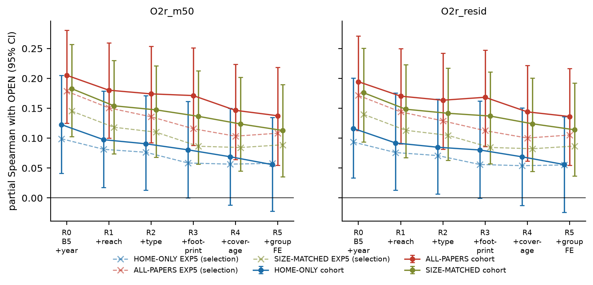
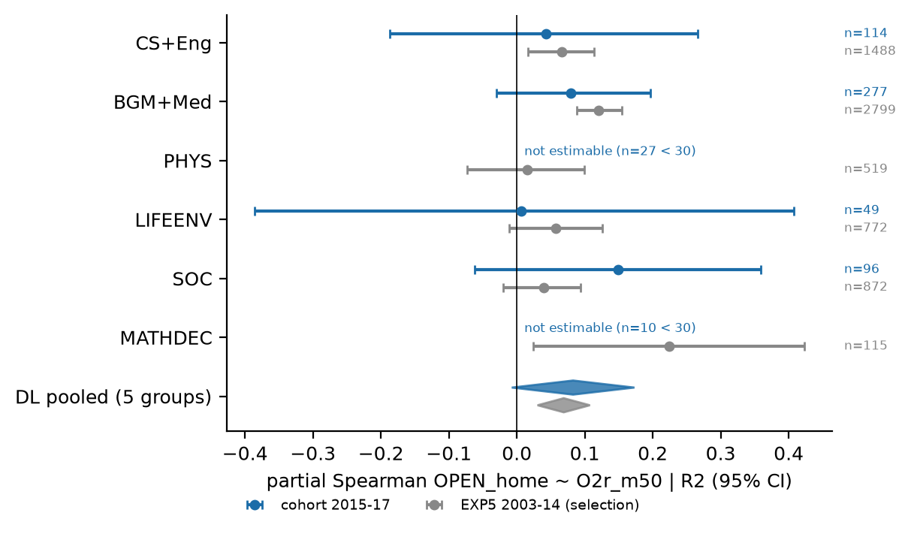
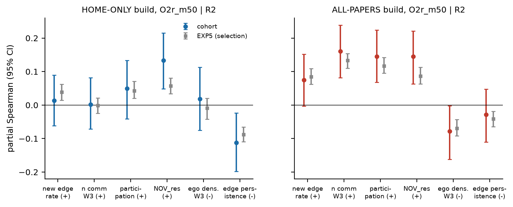
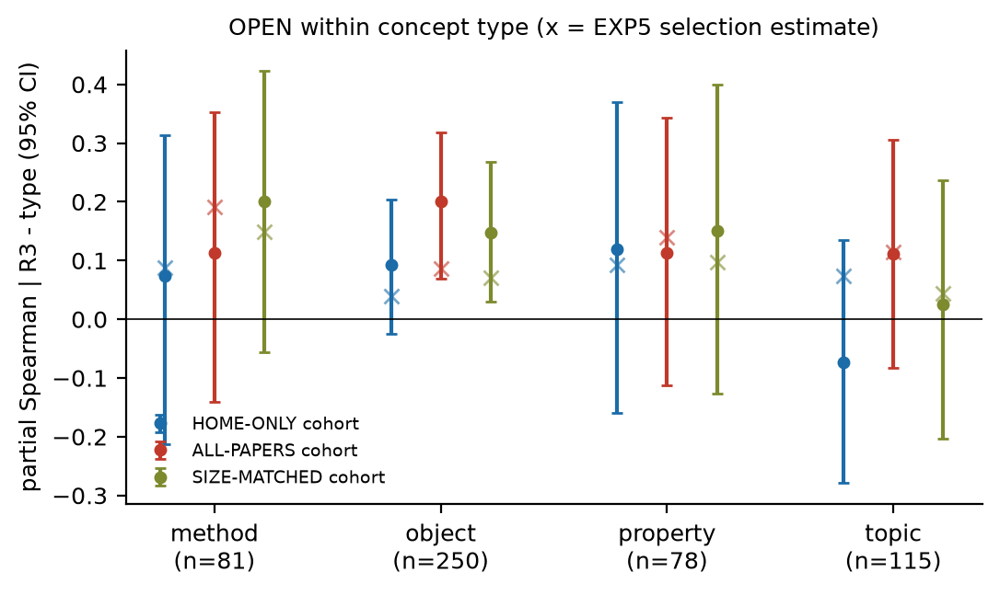
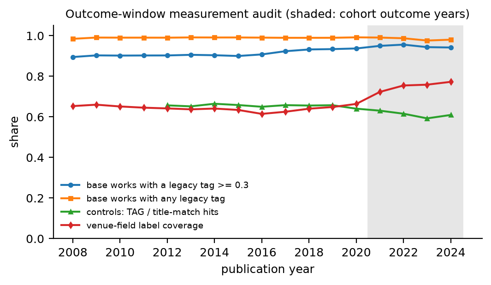

# Do open-neighbourhood concepts spread? A sealed fresh-cohort test (RQ1)

AI Inventor, invention loop iteration 4, artifact `gen_art_experiment_10` (plan `gen_plan_experiment_1_idx1`).
This DEEPENS the EXP8 lead (`round-3/experiment-8/src`): early ego-network "openness" of a concept
anticipates later disciplinary breadth. Here we test it **once**, from a hash-sealed spec, on a **fresh onset cohort
(2015-2017) that no earlier screen touched**, and we attack the three confounds a reviewer names first: mechanical
coupling (off-home papers inside the ego network), concept TYPE (methods travel), and a pre-existing generic footprint.

## Headline

**Verdict (frozen rule, applied in code): CONFIRMED, but marginally, and with no practical gain in prediction.**

* **OPEN_home** is the primary build. It is the mean of six signed, z-scored ego-network components computed from
  **home-venue papers only**, so off-home spread cannot feed it mechanically. Its partial Spearman with later venue-field
  breadth (O2r_m50, t0+6..t0+8) is **+0.091 [+0.013, +0.171] at R2** (B5 + onset year + contact reach + type/level) and
  **+0.080 [+0.001, +0.162] at R3** (+ pre-onset footprint). n = 573 concepts; the resampling unit is the concept;
  2,000 refit bootstraps.
* All five pre-registered clauses hold. (1) CI > 0 at R2 and R3. (2) O2r_resid has the same sign (+0.085 [+0.007, +0.165]).
  (3) Positive in 4 of 5 groups; PHYS is **not estimable** (n = 27 < 30), so this means 4/4 of the estimable groups.
  (4) Positive within method (+0.074, n = 81) AND within object (+0.093, n = 250) concepts; both CIs include 0, and the
  clause asks only for the sign. (5) RETENTION_RATIO_early < 0 given R0 (-0.131 [-0.209, -0.056]).
* **Why the confirmation is fragile:**
  * the R3 lower bound is +0.001;
  * the CI includes 0 once venue-label / home-paper coverage (R4: +0.069 [-0.012, +0.150]) and home-group FE
    (R5: +0.056 [-0.022, +0.135]) are added;
  * the DerSimonian-Laird pooled estimate across groups is +0.083 [-0.007, +0.173];
  * Holm over the 8-test family gives p = 0.048 for O2r_m50 and 0.051 for O2r_resid;
  * the pre-seal power for a true effect of half the EXP5 estimate was only 0.16 (MDE 0.105; within-method MDE 0.31).
  The cohort point estimate (+0.091) is close to the EXP5 selection estimate (+0.076). The effect transfers in
  direction and size; the sample is simply small.
* **Predictive value is negligible.** A frozen OLS on B5 has Spearman 0.768 with O2r_m50; adding OPEN_home gives
  0.770 (+0.002 [-0.003, +0.008]). OPEN_home is a real but small partial association, not a useful forecaster. The frozen
  EXP8 ElasticNet on all 58 indicators still beats B5 on the cohort (+0.030 [+0.012, +0.049]), about half its EXP8
  held-out gain.
* **Mechanical coupling is real and large.** OPEN_all (all papers) gives +0.174 at R2. ALL minus HOME at R3 is
  +0.093 [+0.016, +0.169]. The size-matched build, with ALL papers subsampled to the home counts, sits in between
  (+0.147; SIZEMATCH minus HOME +0.053 [-0.015, +0.117]). Roughly half of the extra ALL-build signal comes from the larger
  paper count and half from the off-home papers themselves. EXP8's openness signal was therefore inflated by coupling;
  the uncoupled remainder is about half as large.
* **Which components carry the home-only signal.** NOV_res (new neighbours outside the expected community,
  +0.134 [+0.049, +0.215]) and low edge persistence (-0.112 [-0.199, -0.023]). The community count n_comm_W3 and
  participation, which dominate the ALL build, are null in the HOME build (+0.002, +0.050). The "many communities" part
  of EXP8's story is largely the off-home papers. Within the home venues, what anticipates breadth is
  *novel, non-persistent* neighbours.
* **Type and footprint do not absorb OPEN.** R1 to R2 (type) changes +0.097 to +0.091, and R2 to R3 (footprint) changes
  +0.091 to +0.080. Named reading (a), "type absorbs OPEN", is FALSE. Reading (b), "mechanical", is also FALSE, since
  OPEN_home's CI excludes 0 at R2.
* **Leads replicated (secondary):**
  * CONTACT_REACH on O2r_m50 given R0: +0.211 [+0.122, +0.294] (EXP8 +0.210), halving to +0.101 without
    intersection-born concepts (EXP8 +0.111);
  * n_authors_early on O1c: +0.115 [+0.065, +0.165] (EXP8 +0.161);
  * RETENTION_RATIO_early < 0 given R0 (EXP8 -0.114), but it vanishes once type and reach enter (R2 -0.043, CI includes 0).
  * n_authors_early does NOT replicate for O3 (+0.014) or O1b (+0.036).



## Design in one paragraph

**Selection data.** These are the 12,499 EXP5 concepts (onsets 2003-2014). On them we froze:
* per-build winsor bounds and z constants of the six components;
* OPEN's definition and signs;
* the rungs, the verdict rules and the Holm family;
* the type labels;
* the frozen B5 prediction models;
* the power-driven extension decision.

The spec was hash-chained into `logs/seal.log` (`S0_prereg`, then `S8_freeze`, sha256 `c3389207...`) **before any
cohort outcome was read**.

**Confirmation data.** One zero-credit pass over the OpenAlex S3 snapshot (2026-09-23, 2,040 files, the same snapshot
as EXP5/EXP8; `passC.py`) collected 2012-2024 title matches for the 1,535 onset-2015-17 candidates and 300 EXP5
controls. Counts for years >= t0+3 went straight into `data/sealed/parts/`; each part's sha256 is in
`logs/sealed_files.log`. After the outcome-blind audits (T1-T3 exact; S3 coverage rule keeps TAG grounding), the
LLM precision gate (94% pass), typing, features and the power rule, the cohort was 1,070 concepts with onsets in 2015-16.
Power was 0.139 < 0.80, so the declared 2017 extension was added, for n = 1,443 in total (634 with a defined O2r_m50,
573 of them with a defined OPEN_home). `s9_unseal.py` unsealed the outcome counts **once**
(`logs/unsealed.json`), computed the outcomes, and scored everything mechanically.

## Results (cohort, 2015-2017 onsets; partial Spearman [95% concept-bootstrap CI], B = 2,000)

Rungs:
* R0 = B5 + onset-year dummies
* R1 = + CONTACT_REACH
* R2 = + type dummies, generic flag and legacy-level dummies
* R3 = + footprint (fp_logN, fp_nfields, fp_reemerge, fp_wiki_pre, newborn)
* R4 = + venue-label and home-paper coverage
* R5 = + home-group FE

| build | outcome | R0 | R1 | R2 | R3 | R4 | R5 | n |
|---|---|---|---|---|---|---|---|---|
| OPEN_home | O2r_m50 | +0.123 [+0.041, +0.205] | +0.097 [+0.018, +0.179] | +0.091 [+0.013, +0.171] | +0.080 [+0.001, +0.162] | +0.069 [-0.012, +0.150] | +0.056 [-0.022, +0.135] | 573 |
| OPEN_home | O2r_resid | +0.116 [+0.034, +0.201] | +0.092 [+0.013, +0.176] | +0.085 [+0.007, +0.165] | +0.080 [-0.000, +0.162] | +0.069 [-0.012, +0.151] | +0.056 [-0.024, +0.136] | 573 |
| OPEN_all | O2r_m50 | +0.205 [+0.125, +0.281] | +0.180 [+0.100, +0.259] | +0.174 [+0.092, +0.253] | +0.171 [+0.088, +0.251] | +0.147 [+0.064, +0.224] | +0.138 [+0.055, +0.218] | 630 |
| OPEN_all | O2r_resid | +0.194 [+0.113, +0.271] | +0.170 [+0.090, +0.250] | +0.163 [+0.082, +0.242] | +0.168 [+0.086, +0.247] | +0.144 [+0.061, +0.222] | +0.136 [+0.055, +0.216] | 630 |
| OPEN_sizematch | O2r_m50 | +0.183 [+0.103, +0.257] | +0.154 [+0.074, +0.230] | +0.147 [+0.068, +0.221] | +0.137 [+0.057, +0.212] | +0.124 [+0.045, +0.202] | +0.113 [+0.035, +0.190] | 591 |
| OPEN_sizematch | O2r_resid | +0.176 [+0.094, +0.250] | +0.148 [+0.068, +0.223] | +0.142 [+0.063, +0.217] | +0.137 [+0.057, +0.211] | +0.124 [+0.045, +0.201] | +0.114 [+0.037, +0.192] | 591 |

EXP5 selection data (2003-14 onsets; not confirmatory), O2r_m50:

| build | R0 | R1 | R2 | R3 | R4 | R5 | n |
|---|---|---|---|---|---|---|---|
| OPEN_home | +0.099 [+0.074, +0.123] | +0.081 [+0.056, +0.105] | +0.076 [+0.051, +0.099] | +0.058 [+0.033, +0.081] | +0.057 [+0.031, +0.082] | +0.058 [+0.033, +0.082] | 6565 |
| OPEN_all | +0.179 [+0.157, +0.203] | +0.151 [+0.129, +0.177] | +0.136 [+0.114, +0.161] | +0.116 [+0.094, +0.141] | +0.103 [+0.080, +0.128] | +0.108 [+0.086, +0.132] | 7186 |
| OPEN_sizematch | +0.145 [+0.118, +0.169] | +0.118 [+0.094, +0.145] | +0.110 [+0.086, +0.136] | +0.086 [+0.062, +0.111] | +0.084 [+0.059, +0.109] | +0.089 [+0.063, +0.115] | 6727 |

### Per group (R2, O2r_m50) and DerSimonian-Laird pooling

| build | CS+Eng | BGM+Med | PHYS | LIFEENV | SOC | MATHDEC (report only) | DL pooled [95% CI] | I2 | positive / 5 |
|---|---|---|---|---|---|---|---|---|---|
| OPEN_home | +0.043 (n=114) | +0.080 (n=277) | NA (n=27) | +0.007 (n=49) | +0.149 (n=96) | NA (n=10) | +0.083 [-0.007, +0.173] | 0.00 | 4 |
| OPEN_all | +0.094 (n=124) | +0.171 (n=287) | +0.218 (n=32) | +0.261 (n=58) | +0.287 (n=116) | NA (n=13) | +0.189 [+0.104, +0.275] | 0.00 | 5 |
| OPEN_sizematch | +0.069 (n=120) | +0.132 (n=279) | +0.224 (n=30) | +0.044 (n=49) | +0.290 (n=100) | NA (n=13) | +0.144 [+0.058, +0.230] | 0.00 | 5 |

### Within concept type (R3 without type dummies; method/object = M1 = M2 concepts only)

| build | method | object | property | topic |
|---|---|---|---|---|
| OPEN_home | +0.074 [-0.212, +0.314] n=81 | +0.093 [-0.025, +0.204] n=250 | +0.119 [-0.159, +0.370] n=78 | -0.073 [-0.279, +0.135] n=115 |
| OPEN_all | +0.112 [-0.141, +0.352] n=90 | +0.200 [+0.069, +0.319] n=265 | +0.113 [-0.113, +0.343] n=89 | +0.111 [-0.083, +0.305] n=132 |
| OPEN_sizematch | +0.200 [-0.056, +0.423] n=85 | +0.148 [+0.029, +0.268] n=253 | +0.150 [-0.127, +0.400] n=85 | +0.025 [-0.203, +0.236] n=118 |

### The six components alone (O2r_m50, R2): cohort vs EXP5 selection

| component (sign) | HOME cohort | HOME EXP5 | ALL cohort | ALL EXP5 |
|---|---|---|---|---|
| new_edge_rate (+) | +0.014 [-0.062, +0.090] | +0.039 [+0.014, +0.062] | +0.075 [-0.003, +0.152] | +0.084 [+0.062, +0.109] |
| n_comm_W3 (+) | +0.002 [-0.071, +0.081] | -0.001 [-0.025, +0.022] | +0.161 [+0.082, +0.238] | +0.133 [+0.110, +0.154] |
| participation (+) | +0.050 [-0.041, +0.133] | +0.043 [+0.020, +0.071] | +0.145 [+0.068, +0.224] | +0.117 [+0.095, +0.142] |
| NOV_res (+) | +0.134 [+0.049, +0.215] | +0.057 [+0.033, +0.081] | +0.145 [+0.064, +0.221] | +0.087 [+0.064, +0.113] |
| ego_density_W3 (-) | +0.018 [-0.075, +0.113] | -0.009 [-0.042, +0.020] | -0.078 [-0.162, -0.002] | -0.070 [-0.091, -0.043] |
| edge_persistence (-) | -0.112 [-0.199, -0.023] | -0.088 [-0.109, -0.066] | -0.029 [-0.110, +0.047] | -0.041 [-0.065, -0.018] |

### RETENTION_RATIO_early, Holm family, build contrasts

| test | estimate [95% CI] | n |
|---|---|---|
| RETENTION_RATIO_early|O2r_m50|R0 | -0.131 [-0.209, -0.056] | 634 |
| RETENTION_RATIO_early|O2r_m50|R2 | -0.043 [-0.116, +0.031] | 634 |
| RETENTION_RATIO_early|O2r_m50|R3 | -0.025 [-0.100, +0.049] | 634 |
| RETENTION_RATIO_early|O2r_resid|R0 | -0.143 [-0.223, -0.069] | 634 |
| RETENTION_RATIO_early|O2r_resid|R2 | -0.060 [-0.131, +0.015] | 634 |
| RETENTION_RATIO_early|O2r_resid|R3 | -0.039 [-0.113, +0.034] | 634 |
| psp difference all_minus_home|R3 (paired) | +0.093 [+0.016, +0.169] | 571 |
| psp difference sizematch_minus_home|R3 (paired) | +0.053 [-0.015, +0.117] | 563 |

| Holm family member (R2, one-sided bootstrap p) | p | Holm p |
|---|---|---|
| OPEN_home|O2r_m50 | 0.0120 | 0.0480 |
| OPEN_home|O2r_resid | 0.0170 | 0.0510 |
| OPEN_all|O2r_m50 | 0.0005 | 0.0040 |
| OPEN_all|O2r_resid | 0.0005 | 0.0040 |
| OPEN_sizematch|O2r_m50 | 0.0005 | 0.0040 |
| OPEN_sizematch|O2r_resid | 0.0005 | 0.0040 |
| RETENTION_RATIO_early|O2r_m50 | 0.1194 | 0.1194 |
| RETENTION_RATIO_early|O2r_resid | 0.0580 | 0.1159 |

### Sensitivities (declared)

| analysis | estimate [95% CI] | n |
|---|---|---|
| OPEN_all_on_home_sample|O2r_m50|R2 | +0.176 [+0.091, +0.263] | 571 |
| OPEN_home|O2r_m50_le2022_TAG|2015onsets|R2 | +0.055 [-0.070, +0.193] | 221 |
| OPEN_home|O2r_m50_TAG|R2 | +0.091 [+0.016, +0.171] | 573 |
| OPEN_home|O2r_m50_MATCH|R2 | +0.122 [+0.058, +0.189] | 927 |
| OPEN_all|O2r_m50_le2022_TAG|2015onsets|R2 | +0.180 [+0.045, +0.311] | 245 |
| OPEN_all|O2r_m50_TAG|R2 | +0.174 [+0.092, +0.256] | 630 |
| OPEN_all|O2r_m50_MATCH|R2 | +0.206 [+0.147, +0.266] | 1073 |
| OPEN_sizematch|O2r_m50_le2022_TAG|2015onsets|R2 | +0.115 [-0.020, +0.248] | 232 |
| OPEN_sizematch|O2r_m50_TAG|R2 | +0.147 [+0.070, +0.220] | 591 |
| OPEN_sizematch|O2r_m50_MATCH|R2 | +0.181 [+0.123, +0.235] | 955 |
| OPEN_home_min5|O2r_m50|R2 | +0.091 [+0.016, +0.171] | 573 |
| OPEN_home_min20|O2r_m50|R2 | +0.083 [+0.002, +0.167] | 528 |
| OPEN_home|O2r_m50|R2|2015_2016_only | +0.130 [+0.037, +0.220] | 414 |






### Placebos and audits

* Within-group outcome permutations (200): the 95th percentile of |psp| is 0.081 (pipeline) and 0.075 (independent
  `audit.py`). The observed value is +0.091.
* Planted psp = 0.10: the pipeline draw gave +0.047 [-0.045, +0.132], so it was **not** recovered. The independent audit
  draw gave +0.150 [+0.065, +0.226], which was recovered. With n = 573 the SE is about 0.045, so a single planted draw
  recovers CI > 0 only about half the time. This matches the pre-seal MDE of 0.105 and is reported as a limit of
  sensitivity, not hidden.
* `audit.py` (statsmodels / scipy, independent code):
  * psp at R2 and R3 re-derived to 1e-16;
  * the DL pooled estimates re-derived by hand, max |diff| 0;
  * O2r_m50 re-computed for 30 cohort concepts directly from the sealed parts with `scipy.stats.hypergeom`,
    max |diff| 2e-11.
* Unit tests:
  * U1: the exp_gen_sol_out builder validates;
  * U2: the six components with n_null = 0 / no betweenness equal EXP8 exactly on 100 concepts, and on all 12,499;
  * U3: HOME filter, including a synthetic concept whose off-home papers carry the new topics;
  * U4: SIZEMATCH at full size equals ALL, and draws are seed-deterministic;
  * U5: outcomes reproduce EXP8 to 1e-15;
  * U6: psp equals EXP8 rq1stats exactly, and a synthetic planted 0.10 lies inside the CI;
  * U7: the seal refuses before the freeze, refuses a second unseal, and refuses a changed spec;
  * U8: the precision-gate prompt is byte-identical to EXP5 (20/20 EXP5 cache hits).
* Pre-seal confirmation signals:
  * the EXP5 R0 signs of all six components match EXP8;
  * OPEN_home is far less coupled to early off-home share than OPEN_all (Spearman 0.086 vs 0.267);
  * cohort-vs-EXP5 standardised mean differences are all |SMD| < 0.33.

### Measurement audit (why TAG grounding is still valid in 2021-24)

OpenAlex froze its legacy concept vocabulary, so tagging of new works might have collapsed inside the outcome window.
It did not.
* The share of base works with a legacy tag >= 0.3 in 2021-2024 is 1.01-1.03x its 2017-19 level.
* The 300 control concepts' TAG / title-match ratio falls only to 0.90-0.96x (minimum 0.902 in 2023). This is just above
  the declared 0.90 bar, so the outcome-blind rule chose TAG.
* MATCH (all verified title matches) was validated anyway on the EXP5 frame: Spearman 0.937 with TAG-based O2r_m50.
  It gives a larger and stronger cohort estimate (+0.122 [+0.058, +0.189], n = 927).
* Venue-label coverage rises from 0.64 to 0.77 in 2021-24, which is why the coverage rung R4 exists.



## Concept TYPE labels (LLM) and their quality

* M1 = google/gemini-2.5-flash-lite labelled all 14,034 concepts, in 4 classes plus a generic flag.
* M2 = openai/gpt-4.1-mini labelled a 300-concept benchmark (50 per group); kappa M1-M2 = 0.78 (v1) and 0.79 (v2).
* 60 benchmark concepts were read blind by the **executor agent (an LLM, not a human annotator)**.
* The gate (M1 precision >= 0.85 for method AND object) **failed twice**: method 0.73 then 0.80, object 1.00 then 0.87,
  after the one allowed prompt revision (sharper definitions, 4 few-shot examples outside the benchmark).
* Declared fallback: type dummies use the M1 v2 labels, and within-type tests use only concepts where M1 = M2. M2 was run
  on all 9,751 M1 method/object concepts; agreement was 0.90.

Details are in `results/type_benchmark_final.json`.

## Deviations from the plan (all in `results/deviations.json`)

* **O4 / citations dropped up front.** `referenced_works` was not read, so there is no O4 and the O4-EBM replication
  is not evaluated.
* **2017 extension applied.** It was triggered by power 0.139 < 0.80.
* **Type gate failed twice.** The M1 = M2 fallback was used.
* **Home rule capped at t0+2.** It counts only years <= t0+2 for cohort concepts, to stay outcome-blind.
* **13 gate labels retried.** Candidates without a parsable precision-gate label were retried once with smaller
  batches, instead of EXP5's MiniLM sense-filter fallback.
* **`s9_unseal.py` edited after the freeze.** The edit came before the unseal and only added a synthetic-data dry run and
  a resume-from-hashed-outcomes path. Scoring logic is unchanged; see the git history.
* **Collinear window flag.** `window_flag` (2017 onsets) is collinear with the 2017 onset dummy and is absorbed by it.
* **Title-match window.** Pass C matched titles only for 2012-2024. The footprint and B5 therefore use EXP5
  `scan/agg_counts.parquet` (identical counts; T1 exact) for the earlier years.

## Scope limits

* **Selected vocabulary.** The frame is the legacy OpenAlex concept vocabulary. Concepts born in 2015-17 that
  OpenAlex/MAG had already named are probably the more successful newborns, so the outcome range is restricted.
* **Range restriction on OPEN_home.** OPEN_home is missing for concepts with fewer than 10 home papers. Excluded concepts
  are broader: mean off-home share 0.49 vs 0.26, and mean O2r_m50 6.7 vs 4.7.
* **One period only.** There is a single period-level replication, so cohort and period effects are confounded.
* **Unpublished taxonomy.** The 4-class type scheme is our own, not a published standard.

## Layout

| path | content |
|---|---|
| `prereg.md`, `results/frozen_spec_v0.json` | S0 pre-registration (hash in `logs/seal.log`) |
| `s0_prereg.py` | writes spec v0 + the S0 seal record |
| `s1_candidates.py` | S1 outcome-blind cohort candidate frame (`data/cohort_candidates.csv`) + 300 EXP5 controls (`data/controls.csv`) |
| `passC.py` | S2 zero-credit S3 snapshot pass (`passC/parts/` per file; merged to `data/passC_*`; sealed counts to `data/sealed/parts/`) |
| `s3_checks.py` | T1-T3 reproduction checks + the S3 outcome-grounding decision (`results/s2_checks.json`, `results/s3_decision.json`, `results/coverage_by_year.csv`) |
| `s4_gate.py` | S4 EXP5 per-concept LLM precision gate (+ U8 prompt identity, + retry) |
| `s5_typing.py` | S5 concept TYPE labels, benchmark, blind gold sheet, gate, M2 fallback (`data/concept_types.csv`) |
| `s6_covariates.py` | S6/S7 footprint, B5, CONTACT_REACH, RETENTION_RATIO_early, n_authors_early, coverage (`data/covariates_*.parquet`) |
| `s7_ego.py` | S7 six OPEN components under ALL / HOME / SIZEMATCH (+ 'full' EXP8 family-A settings) (`data/ego_open_*.parquet`) |
| `s8_select.py` | S8 EXP5 selection ladder, coupling, power + extension, cohort feature table, FREEZE (`results/exp5_selection_result.json`, `results/frozen_spec.json`) |
| `s9_unseal.py` | S9 single unseal, outcomes, frozen scoring, verdict, secondary, placebos (`results/cohort_result.json`) |
| `s_learned.py` | frozen EXP8 learned models on the cohort (`results/learned_models_cohort.json`) |
| `audit.py` | independent post-unseal audit (`results/audit.json`) |
| `make_outputs.py`, `make_report.py`, `readme_tables.py` | figures, `full_method_out.json`, `results/cohort_report.json`, README tables |
| `method.py` | orchestrator (`--only STEP` / `--from STEP`) |
| `lib/` | `ladder.py` (OPEN + rungs + psp bootstrap), `outc.py` (outcomes), `seal2.py` (hash-chained seal), `llmc.py` (budgeted OpenRouter client), `featport.py` (EXP5/EXP8 feature ports), `outjson.py`, and copies of EXP8 `common.py`, `ego.py`, `ego_ctx.py`, `rq1stats.py`, `design.py`, `matcher.py`, `rangefile.py`, `common5.py` |
| `tests/` | U1-U8 (`test_output.py`, `t_ego_flags.py`, `test_units.py`, `t_outcomes.py`) |
| `inputs/` | frozen lexicon, source-field map, EXP3 topic backbones, field backbone (copied from EXP8) |
| `data/` | cohort frame, Pass C merged outputs, covariates, ego builds, types, `features_cohort.parquet` (frozen), `outcomes_cohort.parquet` (post-unseal), `analysis_cohort.parquet` |
| `data/sealed/parts/` | **kept**: the sealed outcome-window counts (hashes in `logs/sealed_files.log`) |
| `results/cohort_report.json` | **headline deliverable**: verdict, clause table, all estimates with CI / n / unit, power, audits, type benchmark, LLM spend |
| `full_method_out.json` (+ `mini_`, `preview_`) | exp_gen_sol_out: one example per cohort concept; output = O2r_m50; `predict_B5` vs `predict_B5_plus_OPEN_home` (frozen, EXP5-fitted) |
| `figures/` | `fig_ladder`, `fig_forest_groups`, `fig_components`, `fig_within_type`, `fig_coverage_audit` (PNG + PDF) |
| `logs/seal.log`, `logs/unsealed.json`, `logs/sealed_files.log` | seal evidence |
| `rederive.py`, `results/rederive.json` | short independent re-derivation of the headline numbers + placebos |
| `llm_cache/` | **kept**: every LLM response (lets a re-run reproduce the labels at $0) |

## How to run

```bash
./restore.sh                                   # .venv with pinned versions (uv)
.venv/bin/python method.py                     # full pipeline; or --only <step>; see method.py for the order
```

The pipeline reads the sibling run artifacts (EXP5 `round-2/experiment-5/src`, EXP8
`round-3/experiment-8/src`, art_33 `round-1/experiment-4/src`, dataset
`round-2/dataset-2/src`) through `RUN_ROOT` in `lib/common.py` (env `AII_RUN_ROOT`). The OpenAlex snapshot
is read from the public S3 bucket; no API key is needed and 0 OpenAlex credits were used. LLM calls go through OpenRouter
(`OPENROUTER_BASE_URL`, `OPENROUTER_API_KEY`); the total spend was **$2.04**. A re-run with `llm_cache/` in place costs $0.
The single unseal cannot be repeated (`logs/unsealed.json`). `s9_unseal.py` resumes scoring from the hashed
`data/outcomes_cohort.parquet`.

## Restoring removed files

| removed path | how to restore |
|---|---|
| `.venv/` | `./restore.sh` (runs `uv venv .venv --python=3.12 && uv pip install --python .venv/bin/python -r requirements.lock.txt`) |
| `__pycache__/`, `lib/__pycache__/` | regenerated automatically by Python on the next run |

Not published to the repository, but kept on the run's volume:
* `passC/parts/`, the per-file parts of the snapshot pass. Rebuild with `.venv/bin/python passC.py --workers 9`.
* `data/ego_open/`, the ego-build chunk files. Rebuild with the `s7_ego.py` commands in `method.py`.
* `llm_cache/`, the LLM response cache.

The merged outputs in `data/` and the sealed parts are published. Files of 100 MB or more are never pushed to the
published repository.
