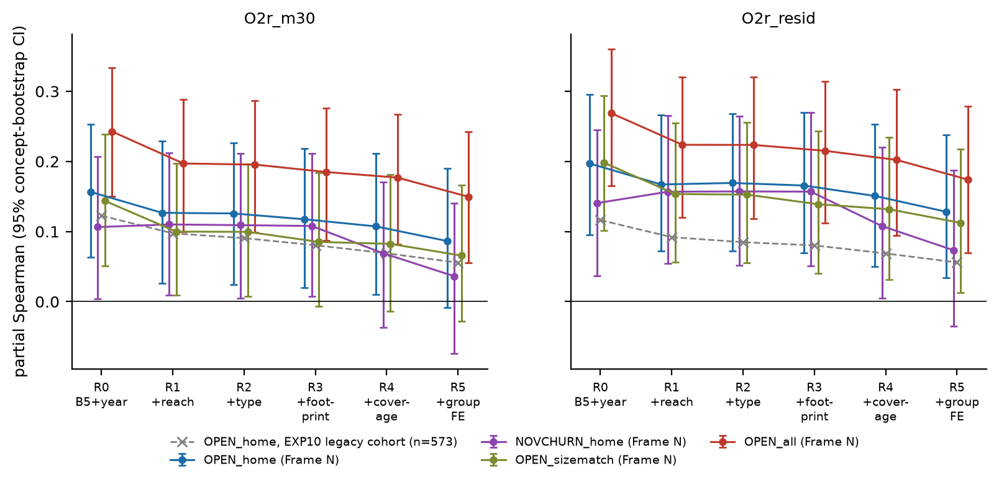

# Does the churn / novelty signal hold for brand-new phrases? A sealed, vocabulary-free confirmation (Frame N)

AI Inventor, invention loop iteration 5, artifact `gen_art_experiment_13` (plan `gen_plan_experiment_1_idx1`).
This DEEPENS the EXP8 → EXP10 openness line. EXP10 found that early home-neighbourhood "openness" (OPEN_home) of a
LEGACY OpenAlex/MAG concept anticipates later disciplinary breadth, marginally (n = 573, power 0.16). Here the same
frozen indices, constants and rung ladder are tested on a **second population that no selection step touched**.
**Frame N** consists of newborn title noun phrases (2003-2015 onsets) that are **not** in the 56,643-concept legacy
vocabulary nor among the 65,026 labels/aliases of art_O7Dq4L02QnDN. All counts come from one zero-credit pass over
the OpenAlex S3 snapshot (2026-09-23, 2,040 files). Outcome rows were sealed at write time and unsealed **once** from
a hash-chained spec (`logs/seal.log`).

## Headline

**Frozen verdict: PARTIAL** (`results/frame_n_result.json → verdicts`). The signal replicates in direction and with a
larger point estimate than on legacy concepts, but not every pre-registered clause holds.

**Clause by clause.** The verdict code was written before the unseal.
* OPEN_home at R3: CI > 0. At R5 (+ home-group FE): CI includes 0.
* NOVCHURN_home at R3: CI > 0.
* Group clause fails. Four groups are estimable and 3 of them are positive. SOC is −0.025 (n = 52); LIFEENV and
  MATHDEC are not estimable (n < 30).
* The pre-unseal power for a true psp of 0.08 was 0.47 at R3 and R5 jointly. The pre-registered F4 cap would
  therefore have capped a CONFIRMED verdict at PARTIAL anyway.
* CONFIRMED_HOLM is false. The Holm p values are 0.052 (OPEN_home R3), 0.112 (R5) and 0.086 (NOVCHURN R3).

**Two declared fallbacks fired, mechanically.**
* **E:** the expected primary n was 451 < 800, so the t0 = 2015 onsets were added (58 concepts, window t0+5..t0+7).
* **A:** only 397 concepts have a finite O2r_m50 AND a finite OPEN_home (< 800), so the primary outcome became
  **O2r_m30** (n = 448).

**Numbers** (primary O2r_m30 unless stated):
* **OPEN_home** is +0.117 [+0.020, +0.218] at R3 and +0.086 [−0.009, +0.190] at R5. On the originally planned
  O2r_m50 (n = 397) it is +0.161 [+0.064, +0.263] at R3 and +0.122 [+0.027, +0.230] at R5. DL pooled over groups
  (R3) is +0.112 [−0.015, +0.239], with I² = 0.
* **NOVCHURN_home** is +0.108 [+0.007, +0.211] at R3 and +0.036 [−0.074, +0.141] at R5.
* **What carries the signal on newborns is novelty, not churn.** NOV_res_home (new neighbours outside the expected
  community) alone gives +0.208 [+0.113, +0.303] at R3. Edge persistence is null here (−0.013), whereas on the
  EXP10 legacy cohort it was −0.112.
* **Mechanical coupling is smaller than on legacy concepts:**
  * ALL − HOME = +0.056 [−0.024, +0.131] (EXP10: +0.093 [+0.016, +0.169]);
  * SIZEMATCH − HOME = −0.031 [−0.090, +0.029];
  * the coupling warning is NOT confirmed.
* **Cheng et al. (2023) replicated on its own terms but not on breadth.** Their ideational consistency predicts
  next-year volume: raw ρ = +0.418 [+0.345, +0.484], and it survives log N(t0+2) at +0.094 [+0.007, +0.186].
  - Its partial Spearman with breadth is negative, −0.064 [−0.159, +0.031], but the CI includes 0, so the
    pre-registered REVERSAL is not confirmed.
  - It is negative and significant for sustained uptake O1b: −0.087 [−0.169, −0.004].
  - Cheng's *embeddedness* analogue is strongly negative with breadth: −0.250 [−0.328, −0.164].
  - Consistency is essentially weighted edge persistence: ρ = +0.79 with edge_persistence_home.
* **Clean variants agree:**
  * rarefied NOVCHURN (10 home papers per year): +0.150 [+0.030, +0.285], n = 294;
  * NOVCHURN built with the size-conditioned persistence null: +0.121 [+0.019, +0.225];
  * the degree-null ego density: −0.072 [−0.175, +0.040].
* **No forecasting gain** (as expected). The CV Spearman of B5 is 0.800; adding OPEN_home changes it by +0.004
  [−0.003, +0.010]. The frozen EXP5 models give +0.005 [−0.001, +0.011].
* **Survivorship.** Relative to legacy newborns reweighted to Frame N's onset-year × size mix, vocabulary-free
  newborns differ as follows:
  * breadth O2r_m50: −14% [−18%, −10%];
  * transience O3: +89% [+29%, +177%], flagged;
  * sustained uptake O1b: −26% [−34%, −18%], flagged.
  Curated vocabularies are survivor-selected.
* **Exploratory, post-unseal; not part of the verdict:**
  * on the higher-precision subset that the second gate model also keeps, OPEN_home is +0.137 [+0.040, +0.245] at
    R3 and +0.106 [+0.004, +0.217] at R5;
  * inverse-variance pooling with the independent EXP10 cohort gives +0.096 [+0.034, +0.158] at R3.

**Main limitation.** Frame N is small: 636 concepts, 448 in the primary set. It is small because genuine title-phrase
newborns that meet the onset rule are rare (4,468 of 132,077 candidates), and because the precision gate removes
named entities, non-English phrases and fragments. The gate is imperfect: keep-precision is 0.63 against the
executor agent's blind labels on a 100-phrase dev set, and that reader is an LLM agent, not a human annotator.



## What was done (pipeline)

| stage | script | output |
|---|---|---|
| S0 pre-registration | `s0_prereg.py` | `prereg.md`, `results/frozen_spec_v0.json`, `logs/seal.log` (S0_prereg) |
| S1 port equivalence + new-code tests | `tests/unit_tests_port.py`, `tests/unit_tests_new.py`, `tests/t1_check.py` | `results/unit_tests.json` (T1, T3, T4, T5, T6, T8 all pass; T1/T4/T8 exact) |
| S2 mining sample | `passM.py` (every 5th works file, 408 files, 17.1M base titles 2000-2017) | `passM/merged/`, `results/sample_balance.json` (ratio 0.195/yr, TVD <= 0.005) |
| S3 candidates | `s3_candidates.py`, `lib/nrules.py` | `data/frame_n_candidates.csv` (132,077), `results/s3_summary.json`, `results/mining_recall.json` |
| S4 full-corpus pass | `passN.py` (2,040 files, titles 1995-2022, 24.2M verified hits) | `open/passN_pre_agg.parquet`, `sealed/parts/sealedA_*.parquet` (hash-logged) |
| S5 onset / SEAL-B / dedup / home / gate | `s5_onset.py`, `s5_gate.py`, `s5_gate2.py` | `data/frame_n_onset.csv`, `sealed/parts/sealedB.parquet`, `data/frame_n_concepts.csv` (636), `results/gate_benchmark.json` |
| S6 features | `s6_features.py` (EXP10 `s7_ego` / `s6_covariates` ports + Cheng + clean variants) | `data/features_frame_n.parquet` (asserted outcome-free) |
| S7 freeze | `s7_freeze.py prepare/power/freeze` | `results/s7_preseal_diagnostics.json`, `results/power.json`, `results/frozen_spec.json` (S7_freeze) |
| S8 single unseal + scoring | `s8_unseal.py`, `lib/scoring.py`, `lib/laddern.py` | `data/outcomes_frame_n.parquet`, `results/frame_n_result.json`, `results/survivorship.json`, `results/case_pairs_frame_n.json` |
| S9 audit / outputs | `audit_frame_n.py`, `make_outputs_n.py`, `exploratory_n.py`, `readme_tables_n.py` | `results/audit.json` (all checks <= 1e-9), `figures/`, `method_out.json`, `results/exploratory.json` |

Pipeline counts (methodology figure `figures/fig_pipeline_counts.png`, numbers in `results/pipeline_counts.json`):

| step | n |
|---|---|
| mined title n-gram keys (20% file sample, k = 3 superset) | 407,114 |
| candidate rule at k_t = 4 (sample count >= 4 and each of the 3 prior years <= 25%) | 216,494 |
| after legacy / generic / place exclusions | 182,917 |
| after POS filter (Pass-N candidates) | 132,077 |
| full-corpus onset 2003-2015 (N(t0) >= 20, prior years < 25% of N(t0+2)) + selection clause | 4,468 |
| after containment dedup + home rule | 2,257 |
| kept by the precision gate (M1 sense rule AND G2 category = concept) | 636 |
| finite OPEN_home | 578 |
| finite OPEN_home and O2r_m30 (primary set) / O2r_m50 | 448 / 397 |

**Indices** use the frozen EXP5 constants from EXP10 `frozen_spec.json`, copied verbatim.
* OPEN_home = mean of six signed winsorised z-scores (new_edge_rate, n_comm_W3, participation, NOV_res,
  −ego_density_W3, −edge_persistence) computed from home-venue papers only in t0−3..t0+2. It needs >= 10 home
  papers and >= 4 finite components.
* NOVCHURN_home = mean(z NOV_res, −z edge_persistence).
* OPEN_all uses all papers; OPEN_sizematch uses all papers subsampled to the home counts (20 draws).

**Outcomes** are MATCH-grounded (verified title-phrase matches):
* O2r_m30 / O2r_m50: rarefied venue-field richness at t0+6..t0+8, exact hypergeometric;
* O2r_resid;
* O1b (sustained share), O1c (log growth) and O3 (transient spike);
* V_next = N(t0+3), Cheng's DV.

**Statistics:**
* psp = partial Spearman: rank-transform, residualise both variables on the rung covariates, then Pearson;
* 2,000 concept bootstraps with refit (seed 20260929); the resampling unit is the concept;
* DerSimonian-Laird pooling over groups with n >= 30, and leave-one-group-out;
* Holm over the 5-member family.

**Rungs:**

| rung | covariates added |
|---|---|
| R0 | B5 (logvol, growth_c, offhome_share, entropy, reach) + onset-year dummies (ref 2008) + window flag |
| R1 | + CONTACT_REACH |
| R2 | + type dummies (the generic flag is constant after the gate) |
| R3 | + fp_logN, fp_nfields, fp_reemerge |
| R4 | + label and home coverage |
| R5 | + home-group FE |

## Results (Frame N; generated from `results/frame_n_result.json` by `readme_tables_n.py`)

{{TABLES}}

**Case pairs** (`results/case_pairs_frame_n.json`, labelled *illustration, not inference*). There are 7 matched
pairs, each with the same group, |pred_B5 diff| <= 0.25 SD and reach within 1. Each pairs a NOVCHURN_home Q5 concept
with a Q1 concept. Their outcomes go in both directions, so they illustrate the mechanism (novel home neighbours)
but are no evidence by themselves.

## Gate quality (read before using Frame N)

| check | result |
|---|---|
| M1 (gemini-2.5-flash-lite, sense rule) vs M2 (gpt-4.1-mini) on 100 random gated phrases | kappa keep 0.61, kappa type 0.73 (F7 not triggered) |
| blind check 1 (60 phrases) vs M1 | keep-precision 0.37 → declared tightening to sense_share >= 0.9 (removed 2 phrases) |
| blind check 2 (fresh 40) vs M1 AND M2 consensus | keep-precision 0.43 |
| categorical gate G2 (gpt-4.1-mini: concept / named entity / non-English / fragment / boilerplate), dev set of the 100 labelled phrases | keep-precision 0.63, recall 1.00 |

The blind reader is the executor agent (an LLM), not a human annotator. The final frame is M1 keep AND G2 = concept.
The residual false positives are mostly borderline fragments ("military sexual" [trauma], "pair share"
[think-pair-share]) plus some Indonesian phrases. Total LLM spend was $0.92 (`results/llm_cost_log.csv`), below the
$1.35 artifact cap.

## Deviations from the plan (all logged in `results/deviations.json`, all decided before the unseal)

1. **D_v2_remine.** The v1 mining (4,500/year cap, k_t 5-7) yielded only 1,540 main-frame phrases, because the cap
   was filled by one-year bursts. The overall mining recall was 6% < 15%, and for that case the plan prescribes
   lowering the cap. Mining was redone once, outcome-blind:
   * k_t fixed at 4;
   * the Pass-N open window widened from t_det+2 to t_det+4, so onsets 0-2 years after detection are findable. The
     selection clause t_det <= t0+2 and the MaskedCounts/SEAL-B guarantees are unchanged; the onset finder never
     read beyond t0+2 for a retained phrase (asserted);
   * the v1 sealed parts were deleted unopened.
2. **D_gate_v2.** Categorical gate G2 was adopted after two failed blind checks (see above).
3. **D_stemkey_counting / D_ascii_tokens / D_generic_tokens_S3.** Stem keys are counted directly; tokens are ASCII
   only; a frozen generic-token list was added at S3, before the S3 hash.
4. **D_fp_reemerge.** fp_reemerge is not constant in Frame N (6%), so it is kept in R3 as in EXP10.
5. **D_cheng_eligibility / D_ppmi_embedding.** The Cheng measures share OPEN_home's >= 10 home-paper eligibility.
   Embeddedness uses a PPMI-SVD topic embedding.
6. **D_passM_before_prereg.** Pass M started about 3 minutes before prereg.md was hashed; its code was final and is
   hashed in S0.
7. **D_partner_split_dropped.** The exploratory partner split (drop-order item 1) was not run.

The remaining declared fallbacks fired as written: E (2015 extension) and A (O2r_m30). The power cap would have
applied if the verdict had been CONFIRMED.

## Repository layout

```
method.py               stage driver (python method.py --from S0 --to S9 --run)
prereg.md               pre-registration (hashed at S0)
passM.py passN.py       snapshot passes (HTTP range reads of the public OpenAlex S3 bucket; 0 API credits)
s0_prereg.py s3_candidates.py s5_onset.py s5_gate.py s5_gate2.py s6_features.py s7_freeze.py s8_unseal.py
audit_frame_n.py make_outputs_n.py exploratory_n.py readme_tables_n.py
lib/                    EXP10 ports (ego.py, ego_ctx.py, ladder.py, outc.py, matcher.py, common5.py, rangefile.py, ...)
                        + new: nrules.py (mining rules), sealn.py (seal), laddern.py (Frame-N rungs), scoring.py,
                        s7ego_port.py / s6cov_port.py (EXP10 s7_ego / s6_covariates, unchanged logic)
ref/                    read-only copy of the EXP10 code the ports come from
tests/                  unit tests T1/T3/T4/T5/T6/T8, recall / k probes
inputs/                 copied EXP10/EXP5/art_O7Dq4L02QnDN inputs (hashes in logs/inputs.sha256)
data/                   candidates, onset, gate tables, features, outcomes, analysis table
open/                   open (pre-outcome) Pass-N counts and the t0-3..t0+2 detail rows of the frame
sealed/                 sealed outcome counts (hash-logged in logs/sealed_files.log; unsealed once)
results/                all result JSON (frame_n_result.json is the main file), prereg specs, gate benchmark
figures/                fig_ladder, fig_forest_groups, fig_components, fig_cheng_reversal, fig_coupling,
                        fig_pipeline_counts, fig_survivorship (PNG + PDF)
logs/                   seal.log (hash chain S0 → S9), sealed_files.log, stage logs
v1_archive/             v1 candidate list / summaries and the sha256 list of the deleted, never-opened v1 sealed parts
method_out.json         exp_gen_sol_out: one example per Frame-N concept (+ full_/mini_/preview_ variants)
```

`sealed/`, `open/`, `data/`, `inputs/`, `llm_cache/` and `passM/merged/` stay on the run's storage volume at these relative
paths. No file in them reaches 100 MB. `data/s3_recovery/contexts/` is split into parts below 100 MB.

## How to run

```bash
uv venv .venv --python=3.12 && uv pip install --python .venv/bin/python -r requirements.lock.txt
.venv/bin/python -m spacy download en_core_web_sm
.venv/bin/python method.py --from S0 --to S9 --run      # needs OPENROUTER_BASE_URL / OPENROUTER_API_KEY for S5
```

`lib/sealn.py` refuses a second unseal: `logs/unsealed.json` exists. To re-score from the hashed outcomes, run
`s8_unseal.py`; it resumes from `data/outcomes_frame_n.parquet` after verifying the hash. The blind-check label files
`results/blind_check_labels*.json` were written by the executor agent and are inputs to `s5_gate.py score` and
`s5_gate2.py eval`.

## Restoring removed files

These paths are listed as `delete` in `.aii/manifest.yaml` and are regenerable:

| path | how to restore |
|---|---|
| `.venv/` | `uv venv .venv --python=3.12 && uv pip install --python .venv/bin/python -r requirements.lock.txt && .venv/bin/python -m spacy download en_core_web_sm` |
| `passM/parts/` | `PYTHONPATH=lib .venv/bin/python passM.py --workers 9` (about 3 min; reads 408 public S3 files) |
| `data/s3_recovery/` | `.venv/bin/python s3_candidates.py --stage recover` |
| `__pycache__/`, `lib/__pycache__/` | created automatically by Python on import |

`restore.sh` runs these commands in order.
